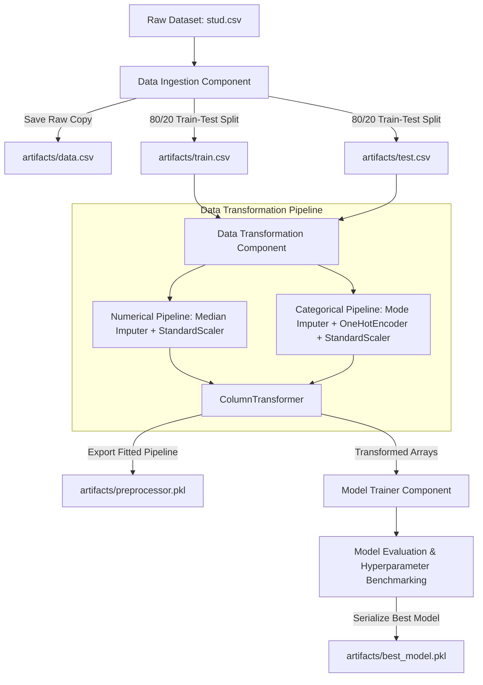

# 🎓 End-to-End Student Performance Predictor

[](https://www.python.org/)
[](https://scikit-learn.org/)
[](https://pandas.pydata.org/)
[](https://numpy.org/)
[](https://opensource.org/licenses/MIT)

> An end-to-end modular Machine Learning project engineered to analyze and predict student academic performance (specifically **Math Scores**) based on socio-economic, demographic, and educational variables.

---

## 📌 Table of Contents

- [Overview](#-overview)
- [Dataset & Problem Statement](#-dataset--problem-statement)
- [Key Features](#-key-features)
- [Architecture & Data Pipeline](#-architecture--data-pipeline)
- [Project Directory Structure](#-project-directory-structure)
- [Model Benchmarks & Results](#-model-benchmarks--results)
- [Installation & Setup](#-installation--setup)
- [How to Run](#-how-to-run)
- [Logging and Exception Handling](#-logging-and-exception-handling)
- [Future Roadmap](#-future-roadmap)
- [Author & Acknowledgements](#-author--acknowledgements)

---

## 🚀 Overview

Understanding factors influencing student exam outcomes enables educational institutions to implement timely interventions and optimize learning support. 

This repository implements a production-style, modular machine learning solution covering:
1. **Exploratory Data Analysis (EDA):** Comprehensive univariate and bivariate analysis, anomaly identification, and correlation assessments.
2. **Automated Data Ingestion:** Scalable dataset ingestion with automated train-test splitting and artifact persistence.
3. **Robust Data Transformation:** Imputation pipelines, categorical one-hot encoding, and feature scaling using Scikit-Learn `Pipeline` and `ColumnTransformer`.
4. **Model Exploration & Evaluation:** Benchmarking multiple regression algorithms (Linear, Ridge, Lasso, Decision Tree, Random Forest, Gradient Boosting) to select the optimal model.
5. **Production Practices:** Centralized logging, custom exception tracking with line-level traceback, and reproducible dependency management.

---

## 📊 Dataset & Problem Statement

The dataset consists of demographic details and exam scores for high school students.

- **Target Variable:** `math_score` (Continuous regression target: 0–100)
- **Input Features:**
  - **Categorical Features:**
    - `gender`: Sex of the student (`female`, `male`)
    - `race_ethnicity`: Ethnic group (`group A`, `group B`, `group C`, `group D`, `group E`)
    - `parental_level_of_education`: Highest degree attained by parents (`some high school`, `high school`, `some college`, `associate's degree`, `bachelor's degree`, `master's degree`)
    - `lunch`: Type of school lunch meal (`standard`, `free/reduced`)
    - `test_preparation_course`: Preparation course completion (`none`, `completed`)
  - **Numerical Features:**
    - `reading_score`: Reading examination score (0–100)
    - `writing_score`: Writing examination score (0–100)

---

## ⚡ Key Features

- **Modular Pipeline Architecture:** Clean separation of concerns between data ingestion, transformation, model training, and prediction.
- **Config-Driven Design:** Dataclass-based configurations (`DataIngestionConfig`, `DataTransformtionConfig`) isolating paths and runtime parameters.
- **Dual Pipeline Preprocessing:**
  - *Numerical Features:* Handled with median imputation (`SimpleImputer`) and standardized via `StandardScaler`.
  - *Categorical Features:* Handled with most-frequent imputation (`SimpleImputer`), encoded with `OneHotEncoder(handle_unknown='ignore')`, and scaled.
- **Robust Exception Handling:** Custom exception framework extracting file name and exact line numbers during failures for seamless debugging.
- **Timestamped Logging:** Centralized runtime tracking saved under `logs/` for production observability.
- **Serialized Artifacts:** Storage of raw/split data (`train.csv`, `test.csv`, `data.csv`), preprocessor pipelines (`preprocessor.pkl`), and trained models (`best_model.pkl`).

---

## 🏗 Architecture & Data Pipeline



---

## 📁 Project Directory Structure

```plaintext
End-to-End-ML-Project/
├── artifacts/                  # Generated runtime artifacts
│   ├── best_model.pkl          # Trained best regression model
│   ├── data.csv                # Ingested raw copy
│   ├── preprocessor.pkl        # Serialized feature transformation pipeline
│   ├── test.csv                # Testing split (20%)
│   └── train.csv               # Training split (80%)
├── data/                       # Source data directory
│   └── stud.csv                # Raw student examination records
├── logs/                       # Timestamped application execution logs
├── notebook/                   # Research & experimentation notebooks
│   ├── EDA STUDENT PERFORMANCE.ipynb  # In-depth Exploratory Data Analysis
│   └── Model_training.ipynb    # Algorithm benchmarking & evaluation
├── src/                        # Core application source code
│   ├── __init__.py
│   ├── exception.py            # Custom exception wrapper with traceback detail
│   ├── logger.py               # Centralized logging configuration
│   ├── utils.py                # Helper utilities (e.g., pickle serialization)
│   ├── components/             # Pipeline components
│   │   ├── __init__.py
│   │   ├── Data_ingestion.py   # Dataset loader & train-test splitter
│   │   ├── Data_transformation.py # Preprocessor builder & transformer
│   │   └── model_trainer.py    # Model trainer script
│   └── pipeline/               # End-to-end execution pipelines
│       ├── __init__.py
│       ├── train_pipeline.py   # Automated training orchestrator
│       └── predict_pipeline.py # Inference pipeline for new data
├── .gitignore                  # Git ignore specifications
├── requirements.txt            # Project dependencies
├── setup.py                    # Package setup script
└── README.md                   # Project documentation
```

---

## 📈 Model Benchmarks & Results

During model exploration in [`notebook/Model_training.ipynb`](notebook/Model_training.ipynb), multiple regression algorithms were evaluated using $R^2$, Root Mean Squared Error (RMSE), Mean Absolute Error (MAE), and Mean Squared Error (MSE):

| Model | $R^2$ Score | RMSE | MAE | MSE | Rank |
| :--- | :---: | :---: | :---: | :---: | :---: |
| **Lasso Regression** | **0.8809** | **5.3837** | **4.2046** | **28.9845** | 🥇 **Best** |
| **Ridge Regression** | 0.8806 | 5.3904 | 4.2111 | 29.0566 | 🥈 |
| **Linear Regression** | 0.8804 | 5.3940 | 4.2148 | 29.0952 | 🥉 |
| **Gradient Boosting** | 0.8705 | 5.6141 | 4.3152 | 31.5182 | 4 |
| **Random Forest** | 0.8529 | 5.9827 | 4.6204 | 35.7925 | 5 |
| **Decision Tree** | 0.7513 | 7.7795 | 6.2400 | 60.5200 | 6 |

> **Key Takeaway:** Regularized linear models (Lasso and Ridge) demonstrated superior generalization with lower error variance compared to complex tree ensembles on this dataset, achieving an $R^2$ score of approximately **88.1%**.

---

## ⚙️ Installation & Setup

### 1. Prerequisites
- Python **3.8** or higher
- Git

### 2. Clone the Repository
```bash
git clone https://github.com/Monodip16/End-to-End-ML-Project.git
cd End-to-End-ML-Project
```

### 3. Create and Activate Virtual Environment

- **Windows (PowerShell):**
  ```powershell
  python -m venv .venv
  .venv\Scripts\Activate.ps1
  ```
- **macOS / Linux:**
  ```bash
  python3 -m venv .venv
  source .venv/bin/activate
  ```

### 4. Install Dependencies
```bash
pip install --upgrade pip
pip install -r requirements.txt
```

---

## 🏃 How to Run

### Step 1: Run Data Ingestion and Transformation
Executing the ingestion component loads the raw dataset, creates train/test splits in `artifacts/`, and triggers the transformation pipeline:
```bash
python src/components/Data_ingestion.py
```

### Step 2: Explore Jupyter Notebooks
To review the exploratory data analysis and model training workflows:
```bash
jupyter notebook
```
Navigate to:
- `notebook/EDA STUDENT PERFORMANCE.ipynb`
- `notebook/Model_training.ipynb`

---

## 🔍 Logging and Exception Handling

### Custom Exception Handling
The custom exception class in [`src/exception.py`](src/exception.py) dynamically intercepts execution errors, formatting tracebacks with the exact script name and line number:
```python
from src.exception import CustomException
import sys

try:
    # Code execution
    ...
except Exception as e:
    raise CustomException(e, sys)
```

### Centralized Logging
Execution events and errors are automatically logged with standardized timestamps under [`logs/`](logs/):
```python
from src.logger import logging

logging.info("Data ingestion completed successfully")
```

---

## 🔮 Future Roadmap

- [ ] Complete automated model training pipeline in `src/components/model_trainer.py`.
- [ ] Build end-to-end inference pipeline in `src/pipeline/predict_pipeline.py`.
- [ ] Develop interactive Web UI with **Flask** or **Streamlit** for real-time score predictions.
- [ ] Containerize application using **Docker**.
- [ ] Setup CI/CD deployment workflow via **GitHub Actions** to AWS (Beanstalk / EC2) or Azure.

---

## 👤 Author & Acknowledgements

**Monodip Das**  
- **GitHub:** [@Monodip16](https://github.com/Monodip16)  
- **Email:** [dasmonodip108@gmail.com](mailto:dasmonodip108@gmail.com)

*If you find this repository helpful, consider leaving a ⭐ on GitHub!*
